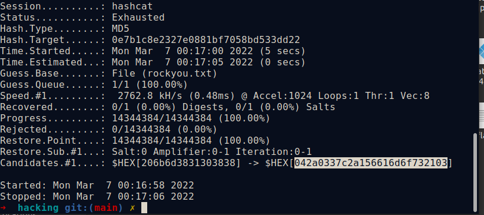
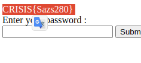
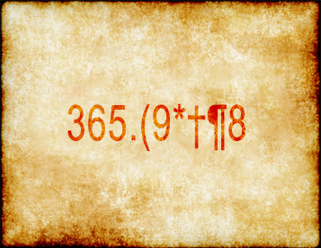
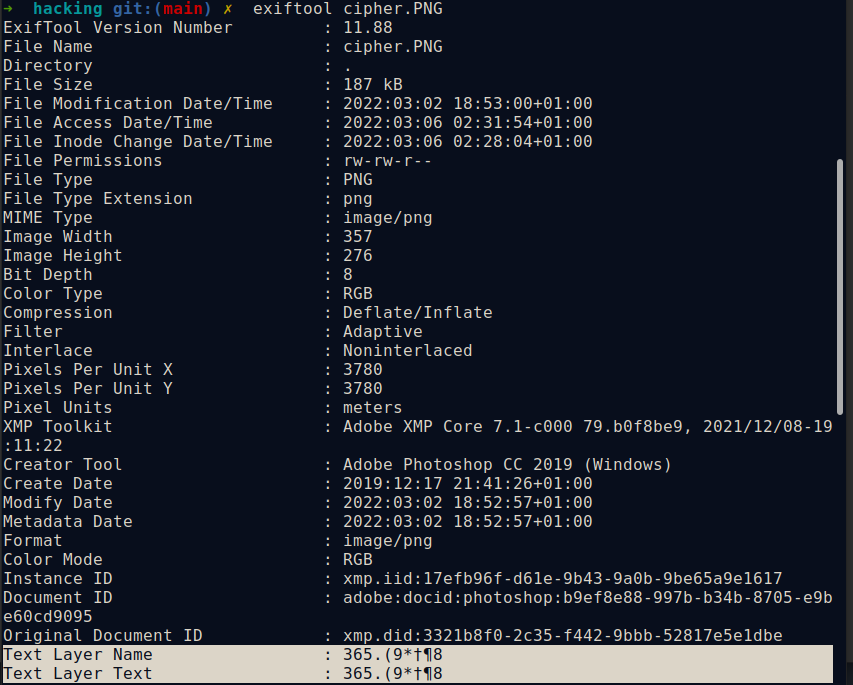
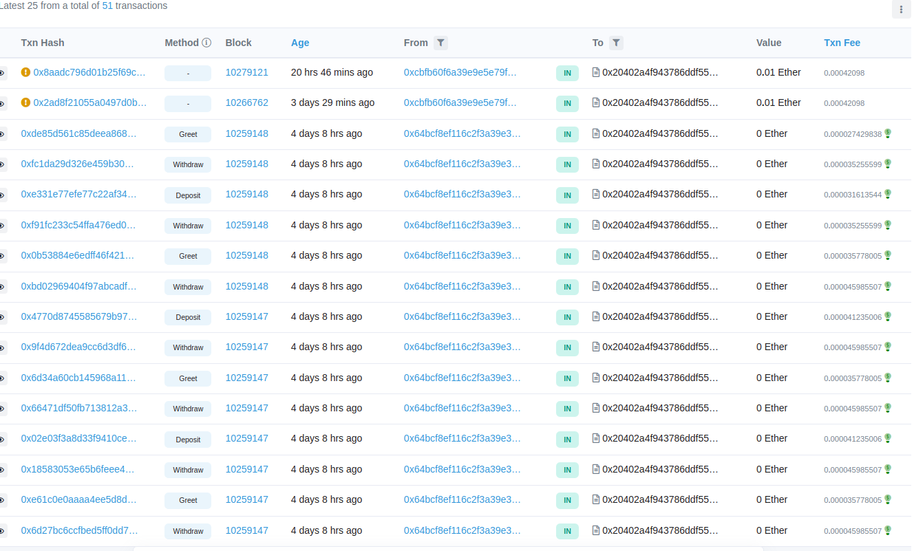
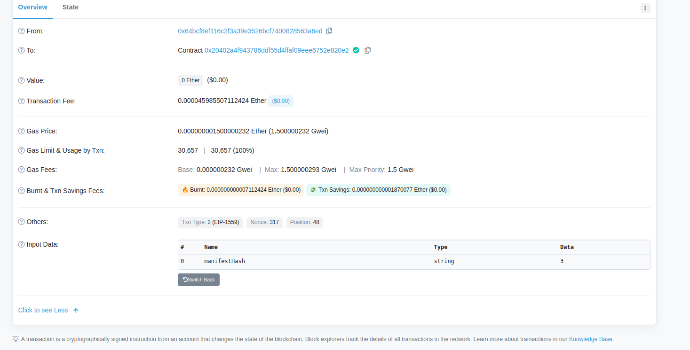
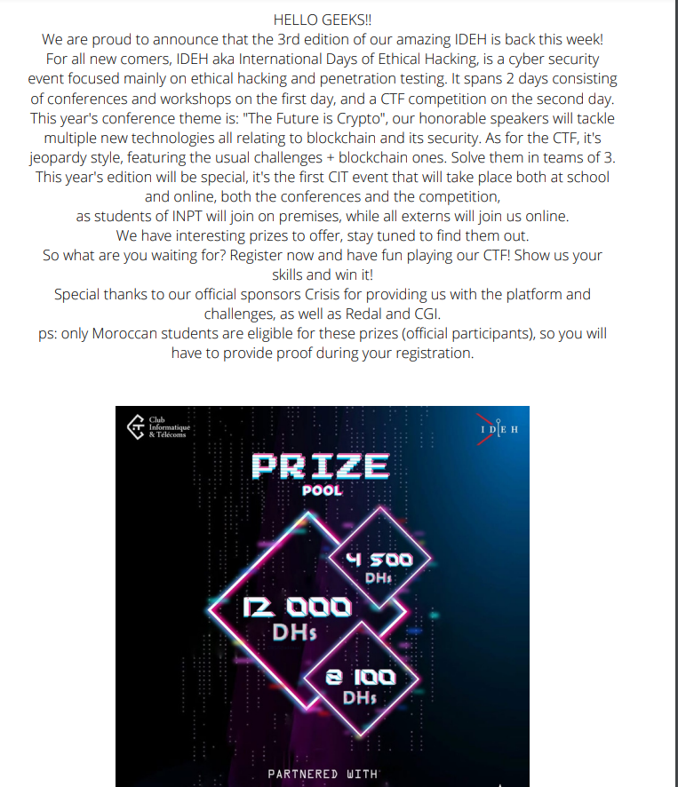
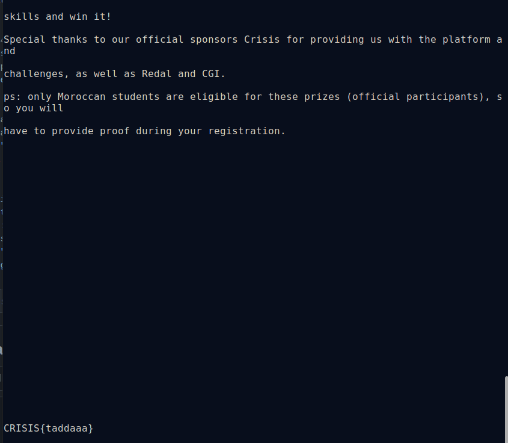

## INPT DNS 
  
 

DNS Zone , check writeup for more information
### Challenge Description
<br/>
"You can dig deeper" means dig command.
 
I tried dig requesting TXT records.This says DNS zone so I googled it to find that DNS Zone transfer is sometimes referred through its opcode mnemonic AXFR.SO A zone transfer reveals a lot of information about the domain. that's why we get our flag!
 
### 

<br/>

## Palette 
 
  
 

Open the image in the GIMP editor, select the color picker tool in the tools menu, select each box from these 18 boxes by color picker.
The HTML notation in hexadecimal of these colors in 18 box will be:
43ffff  52ffff  49ffff  53ffff  49ffff  53ffff
7bffff  6bffff  36ffff  35ffff  50ffff  38ffff
58ffff  65ffff  61ffff  48ffff  54ffff  7dffff

When the hexadecimal value is converted into ASCII using cyberchef, the output will be:
CÿÿRÿÿIÿÿSÿÿIÿÿSÿÿ{ÿÿkÿÿ6ÿÿ5ÿÿPÿÿ8ÿÿXÿÿeÿÿaÿÿHÿÿTÿÿ}ÿÿ
we delete the characters ÿÿ and we will have our flag: 
CRISIS{k65P8XeaHT}

 

## Login:
  
 

First I tried to unpack the apk file given to us using apktool. You can do this with the command:

 ```$apktool d login.apk ```
 ```$grep -R  CRISIS  $Binary file lib/armeabi-v7a/libapp.so matches ```
 - We tried opening the file using Notepad++ and this is what gave us searching the first keyword ***CRISIS***
 

## The magic of php:
  
 

This challenge gives you the source code of the web page 

- Website : http://18.168.221.53/
And accessing the web page you can insert passwords, but the challenges asks to not use bruteforce on the page, Reading the source code ``` if(md5($password) == 0e7b1c8e2327e0881bf7058bd533dd22)
    {
        echo "$FLAG</br>";
    }
    else echo "Incorrect Password </br>";``` the is a clear condition on the md5($password) it should be the value "0e7b1c8e2327e0881bf7058bd533dd22" to see the flag.
So I got the idea to crack this hash:

```$sudo hashcat -m 0 --force hash rockyou.txt ``` 
 
- what we get is a HEX value 206b6d3831303838 which we enter as a password and the flag gets displayed
-  
- 
## The gold bug 1843: 
  
 


We are provided with 2 png files the ***cipher.png*** file and ***the golden bug***
 

- After reading the Text Layer Name with exiftool, we find the string we want to decode. This challenge describe some golden bug story, so this type of message has something to do with this method.
 
<a href="https://en.wikipedia.org/wiki/The_Gold-Bug">The gold-bug(1843)</a>
A simple search of how to decode this type of Message on Google we find the dcode page!
<a href="https://www.dcode.fr/scarabee-or-poe">Dcode:Chiffre du Scarabée d'Or</a>


## Stolen Funds
Here is the first smart contracts challenge I solved. Solving it allowed me to learn about accessing and inspecting contract storage. 

### Additional information:

- Network: Rinkeby
- Address: 0x20402a4F943786DdF55D4Ffaf09EEe6752e820e2
 As our challenge is, supposedly, to find a ***Hacker*** that have withdrawn some funds so I tried tracing those withdraws using this website, we can see all the transactions to that specific Adress of our Hacker:
 <a href="https://rinkeby.etherscan.io/">Rinkeby</a>
 
 
We can see that there are 51 transactions associated with that contract. Let’s examine them.
Decoding the Input Data of each transaction gives us a character:
 
I decided to give it a shot and gather those characters manually for each withdraw, to finnaly get the full flag.

## PDF challenge: 
  
 

The attachement of this challenge is just a PDF describing the competition which seemd suspicious to me.So it's the  chance to try the ***pdf2txt.py*** tool:
 <a href="https://github.com/euske/pdfminer/blob/master/tools/pdf2txt.py">pdf2txt.py</a>

 
```python3 pdf2text.py pdf_stegano.pdf```
 
