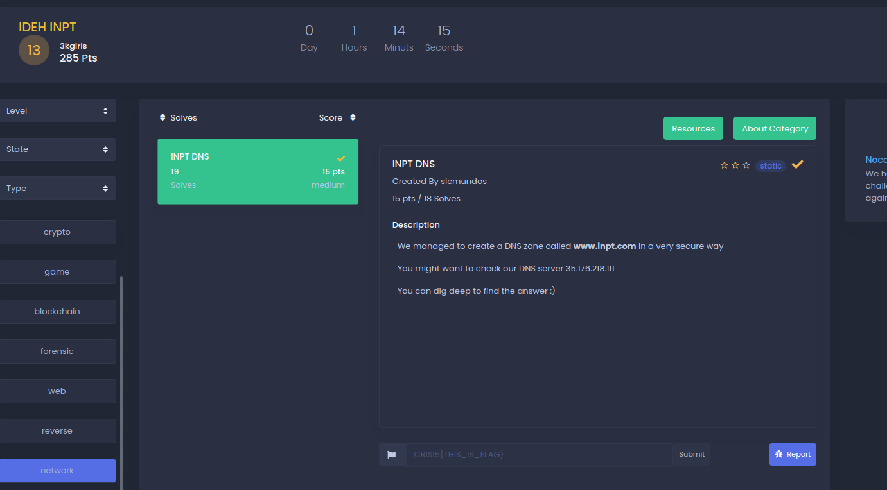
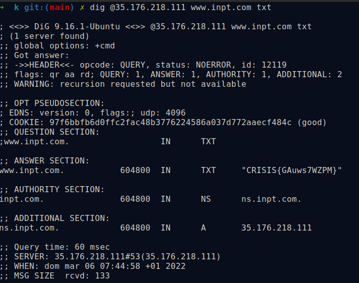
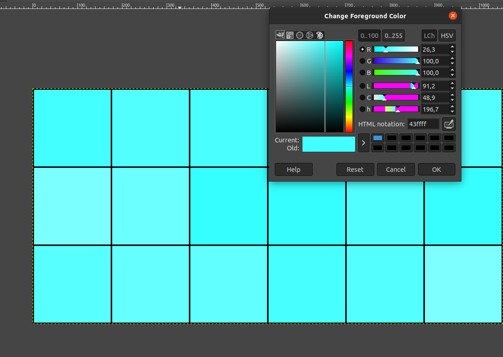
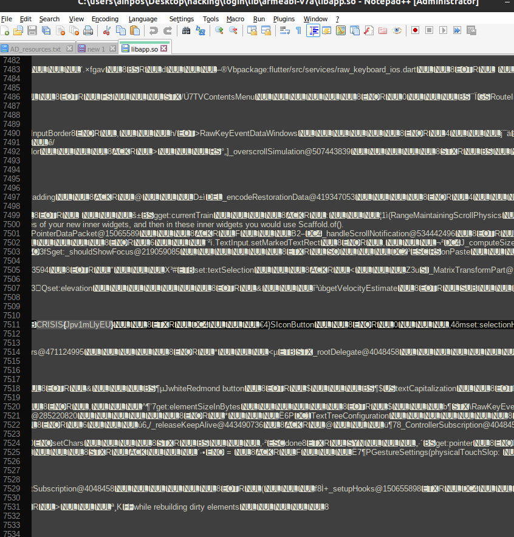

## INPT DNS 
DNS Zone , check writeup for more information
### Challenge Description
<br/>
"You can dig deeper" means dig command.
 
I tried dig requesting TXT records.This says DNS zone so I googled it to find that DNS Zone transfer is sometimes referred through its opcode mnemonic AXFR.SO A zone transfer reveals a lot of information about the domain. that's why we get our flag!
 
### 

<br/>

## Palette 
 

Open the image in the GIMP editor, select the color picker tool in the tools menu, select each box from these 18 boxes by color picker.
The HTML notation in hexadecimal of these colors in 18 box will be:
43ffff  52ffff  49ffff  53ffff  49ffff  53ffff
7bffff  6bffff  36ffff  35ffff  50ffff  38ffff
58ffff  65ffff  61ffff  48ffff  54ffff  7dffff

When the hexadecimal value is converted into ASCII using cyberchef, the output will be:
CÿÿRÿÿIÿÿSÿÿIÿÿSÿÿ{ÿÿkÿÿ6ÿÿ5ÿÿPÿÿ8ÿÿXÿÿeÿÿaÿÿHÿÿTÿÿ}ÿÿ
we delete the characters ÿÿ and we will have our flag: 
CRISIS{k65P8XeaHT}

 

## Login:
First I tried to unpack the apk file given to us using apktool. You can do this with the command:

 ```$apktool d login.apk ```
 ```$grep -R  CRISIS  $Binary file lib/armeabi-v7a/libapp.so matches ```
 - We tried opening the file using Notepad++ and this is what gave us searching the first keyword ***CRISIS***
 

